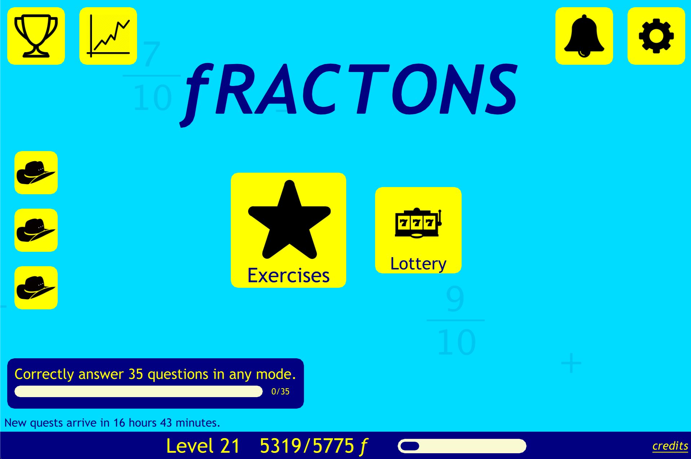
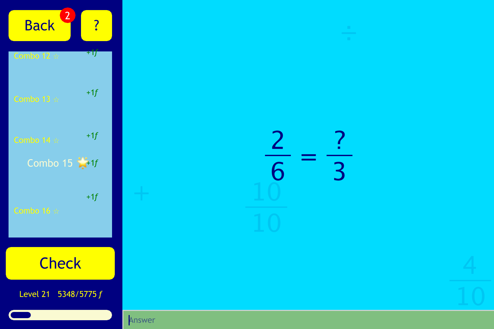
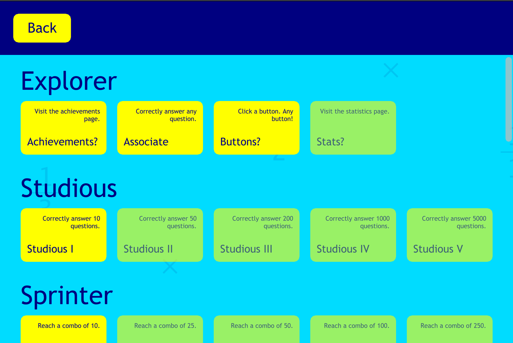
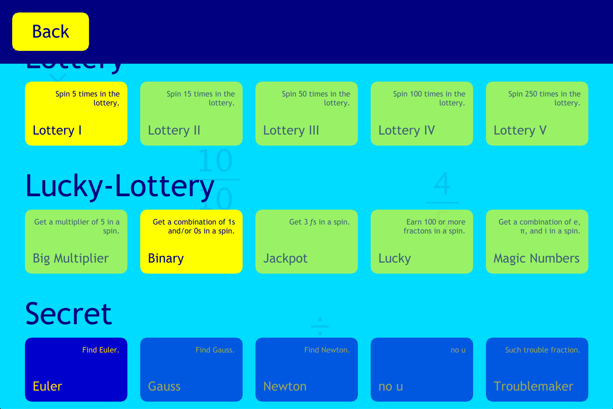

# Fractons

A highly interactive fractions game for elementary students made using Felgo/QML.

Check it out in [releases](https://github.com/TrebledJ/fractons/releases)!

## Features

* Exp + Levelling Mechanics 📈
* Clean, slick, and bubbly UI
* 5 different question modes!
* 40+ achievements (including secret achievements! 🤫)
* Statistics, to see how well you're doing
* Fun little lottery system
* Number pad (for mobile/tablets), configurable in settings
* Daily quests! 🤠
* SFX and background music 🎵
* Floating fractions in the background (with the occasional secret! 🤫)
* Notifications to notify you when you level up, complete a quest, or earned an achievement

## Showcase

Main menu. Daily quests are on the left. Achievements, statistics on the top left. Notifications and settings on the top right.

Solving questions in Balance mode. How fast can you fill in the question mark?

Tons of achievements to try to earn!

## History

Fractons was originally programmed in Flash/Actionscript 2.0 for a ninth grade design project targetting fifth/sixth graders. It was later reprogrammed in a more appealing UI with added user engagement features such as daily quests and the lottery.
